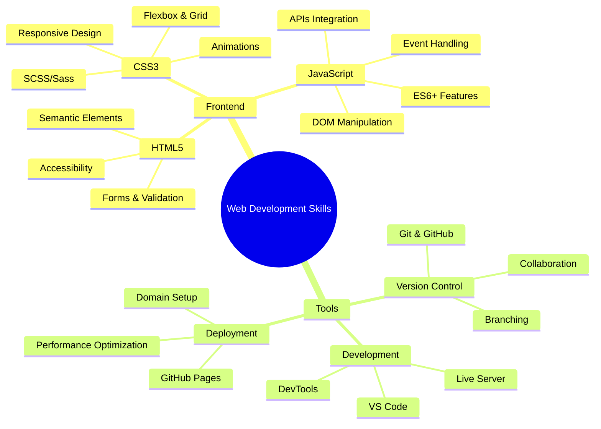

# 🎓 GeeksforGeeks Web Development Program Repository

[](https://chandi977.github.io/GFG/)
[](https://developer.mozilla.org/en-US/docs/Web/HTML)
[](https://developer.mozilla.org/en-US/docs/Web/CSS)
[](https://developer.mozilla.org/en-US/docs/Web/JavaScript)
[](https://opensource.org/licenses/MIT)

> **A comprehensive collection of web development projects, assignments, and practice exercises completed during the GeeksforGeeks Full Stack Web Development Program.**

<div align="center">


[](https://github.com/Chandi977/GFG/stargazers)
[](https://github.com/Chandi977/GFG/network/members)

</div>

---

## 📋 Table of Contents

- [📖 About](#-about)
- [🗂️ Repository Structure](#️-repository-structure)
- [🌐 Live Demos](#-live-demos)
- [💻 Technologies Used](#-technologies-used)
- [🚀 Getting Started](#-getting-started)
- [✨ Project Highlights](#-project-highlights)
- [🎯 Learning Objectives](#-learning-objectives)
- [📈 Progress Tracking](#-progress-tracking)
- [🤝 Contributing](#-contributing)
- [📞 Contact](#-contact)
- [📄 License](#-license)

---

## 📖 About

This repository serves as a comprehensive documentation of my learning journey through the **GeeksforGeeks Web Development Program**. It contains organized collections of:

- ✅ **Assignments** - Structured projects demonstrating core web development concepts
- 📚 **Class Work** - In-class exercises and hands-on practice implementations
- 🏠 **Home Work** - Daily practice exercises and skill reinforcement activities
- 🚀 **Projects** - Complete web applications showcasing learned skills and real-world applications

Each section includes **live demonstrations** hosted on GitHub Pages, making it easy to view and interact with the implementations directly in your browser.

---

## 🗂️ Repository Structure

```
GFG/
├── 📁 Assignment/
│   ├── 📁 Assignment 1/           # HTML Fundamentals & Basic Structure
│   │   ├── index.html
│   │   ├── style.css
│   │   └── assets/
│   ├── 📁 Assignment 2/           # CSS Layouts & Responsive Design
│   │   ├── index.html
│   │   ├── style.css
│   │   └── assets/
│   ├── 📁 Assignment 3/           # Advanced CSS & Interactive Elements
│   │   ├── index.html
│   │   ├── style.css
│   │   ├── script.js
│   │   └── assets/
│   └── 📁 Assignment 4/           # JavaScript Integration
│       ├── index.html
│       ├── style.css
│       ├── script.js
│       └── assets/
├── 📁 Class Work/
│   ├── 📁 Advanced CSS/
│   │   ├── 📁 work 1/             # CSS Selectors & Properties
│   │   │   ├── index.html
│   │   │   └── style.css
│   │   ├── 📁 work 2/             # Flexbox & Positioning
│   │   │   ├── index.html
│   │   │   └── style.css
│   │   └── 📁 work 3/             # CSS Animations & Transitions
│   │       ├── index.html
│   │       └── style.css
│   ├── 📁 Grid/
│   │   ├── 📁 work1/              # Grid Fundamentals
│   │   │   ├── index.html
│   │   │   └── style.css
│   │   ├── 📁 work2/              # Complex Grid Layouts
│   │   │   ├── index.html
│   │   │   └── style.css
│   │   └── 📁 work3/              # Responsive Grid Systems
│   │       ├── index.html
│   │       └── style.css
│   └── 📁 JavaScript/             # JavaScript Fundamentals
│       ├── 📁 work1/
│       ├── 📁 work2/
│       └── 📁 work3/
├── 📁 HomeWork/
│   ├── 📁 Day 1/                  # HTML Structure & Semantic Elements
│   │   ├── index.html
│   │   └── README.md
│   ├── 📁 Day 2/                  # CSS Styling & Layout Basics
│   │   ├── index.html
│   │   ├── style.css
│   │   └── README.md
│   ├── 📁 Day 3/                  # Advanced Styling Techniques
│   │   ├── index.html
│   │   ├── style.css
│   │   └── README.md
│   └── 📁 Day N/                  # Ongoing Daily Practice
│       └── ...
├── 📁 Project/
│   ├── 📁 Portfolio Website/       # Personal Portfolio Project
│   ├── 📁 E-commerce Landing/      # E-commerce Landing Page
│   └── 📁 Final Project/          # Capstone Project
├── 📁 Practice/                   # Additional Practice Exercises
│   ├── 📁 HTML/
│   ├── 📁 CSS/
│   └── 📁 JavaScript/
├── 📄 README.md                   # Repository Documentation
├── 📄 LICENSE                     # MIT License
└── 📄 .gitignore                  # Git Ignore Rules
```

---

## 🌐 Live Demos

### 📝 Assignments

<div align="center">

| Assignment       | Description                       | Live Demo                                                                  | Source Code                             | Status         |
| ---------------- | --------------------------------- | -------------------------------------------------------------------------- | --------------------------------------- | -------------- |
| **Assignment 1** | HTML Fundamentals & Basic Styling | [🔗 Live Demo](https://chandi977.github.io/GFG/Assignment/Assignment%201/) | [📄 Code](./Assignment/Assignment%201/) | ✅ Complete    |
| **Assignment 2** | CSS Layouts & Responsive Design   | [🔗 Live Demo](https://chandi977.github.io/GFG/Assignment/Assignment%202/) | [📄 Code](./Assignment/Assignment%202/) | ✅ Complete    |
| **Assignment 3** | Advanced CSS & Animations         | [🔗 Live Demo](https://chandi977.github.io/GFG/Assignment/Assignment%203/) | [📄 Code](./Assignment/Assignment%203/) | ✅ Complete    |
| **Assignment 4** | JavaScript Integration            | [🔗 Live Demo](https://chandi977.github.io/GFG/Assignment/Assignment%204/) | [📄 Code](./Assignment/Assignment%204/) | 🚧 In Progress |

</div>

### 🎓 Class Work

#### 🎨 Advanced CSS

<div align="center">

| Work       | Topic                        | Live Demo                                                                             | Source Code                                        | Features                  |
| ---------- | ---------------------------- | ------------------------------------------------------------------------------------- | -------------------------------------------------- | ------------------------- |
| **Work 1** | CSS Selectors & Properties   | [🔗 Live Demo](https://chandi977.github.io/GFG/Class%20Work/Advanced%20CSS/work%201/) | [📄 Code](./Class%20Work/Advanced%20CSS/work%201/) | Selectors, Pseudo-classes |
| **Work 2** | CSS Flexbox & Positioning    | [🔗 Live Demo](https://chandi977.github.io/GFG/Class%20Work/Advanced%20CSS/work%202/) | [📄 Code](./Class%20Work/Advanced%20CSS/work%202/) | Flexbox, Positioning      |
| **Work 3** | CSS Animations & Transitions | [🔗 Live Demo](https://chandi977.github.io/GFG/Class%20Work/Advanced%20CSS/work%203/) | [📄 Code](./Class%20Work/Advanced%20CSS/work%203/) | Keyframes, Transforms     |

</div>

#### 📊 CSS Grid

<div align="center">

| Work       | Topic                   | Live Demo                                                                | Source Code                           | Features            |
| ---------- | ----------------------- | ------------------------------------------------------------------------ | ------------------------------------- | ------------------- |
| **Work 1** | Grid Fundamentals       | [🔗 Live Demo](https://chandi977.github.io/GFG/Class%20Work/Grid/work1/) | [📄 Code](./Class%20Work/Grid/work1/) | Basic Grid Layout   |
| **Work 2** | Complex Grid Layouts    | [🔗 Live Demo](https://chandi977.github.io/GFG/Class%20Work/Grid/work2/) | [📄 Code](./Class%20Work/Grid/work2/) | Advanced Grid Areas |
| **Work 3** | Responsive Grid Systems | [🔗 Live Demo](https://chandi977.github.io/GFG/Class%20Work/Grid/work3/) | [📄 Code](./Class%20Work/Grid/work3/) | Mobile-First Design |

</div>

#### ⚡ JavaScript (Coming Soon)

<div align="center">

| Work       | Topic                   | Live Demo                                                                      | Source Code                                 | Features             |
| ---------- | ----------------------- | ------------------------------------------------------------------------------ | ------------------------------------------- | -------------------- |
| **Work 1** | JavaScript Fundamentals | [🔗 Live Demo](https://chandi977.github.io/GFG/Class%20Work/JavaScript/work1/) | [📄 Code](./Class%20Work/JavaScript/work1/) | Variables, Functions |
| **Work 2** | DOM Manipulation        | [🔗 Live Demo](https://chandi977.github.io/GFG/Class%20Work/JavaScript/work2/) | [📄 Code](./Class%20Work/JavaScript/work2/) | Event Handling       |

</div>

### 🏠 Home Work

<div align="center">

| Day       | Focus Area                         | Live Demo                                                         | Source Code                    | Skills Practiced |
| --------- | ---------------------------------- | ----------------------------------------------------------------- | ------------------------------ | ---------------- |
| **Day 1** | HTML Structure & Semantic Elements | [🔗 Live Demo](https://chandi977.github.io/GFG/HomeWork/Day%201/) | [📄 Code](./HomeWork/Day%201/) | HTML5 Semantics  |
| **Day 2** | CSS Styling & Layout Basics        | [🔗 Live Demo](https://chandi977.github.io/GFG/HomeWork/Day%202/) | [📄 Code](./HomeWork/Day%202/) | CSS Fundamentals |
| **Day 3** | CSS Flexbox & Grid Basics          | [🔗 Live Demo](https://chandi977.github.io/GFG/HomeWork/Day%203/) | [📄 Code](./HomeWork/Day%203/) | Layout Systems   |
| **Day 4** | JavaScript Introduction            | [🔗 Live Demo](https://chandi977.github.io/GFG/HomeWork/Day%204/) | [📄 Code](./HomeWork/Day%204/) | JS Basics        |

</div>

### 🚀 Projects

<div align="center">

| Project                | Description                 | Status         | Live Demo                                                     | Source Code                     | Technologies  |
| ---------------------- | --------------------------- | -------------- | ------------------------------------------------------------- | ------------------------------- | ------------- |
| **Portfolio Website**  | Personal Portfolio Showcase | 🚧 In Progress | [🔗 Demo](https://chandi977.github.io/GFG/Project/Portfolio/) | [📄 Code](./Project/Portfolio/) | HTML, CSS, JS |
| **E-commerce Landing** | Product Landing Page        | 📋 Planned     | Coming Soon                                                   | [📄 Code](./Project/Ecommerce/) | HTML, CSS, JS |
| **Final Project**      | Full-Stack Application      | 📋 Planned     | Coming Soon                                                   | [📄 Code](./Project/Final/)     | MERN Stack    |

</div>

---

## 💻 Technologies Used

<div align="center">

### Frontend Technologies


### Tools & Platforms


### Design & Development


</div>

---

## 🚀 Getting Started

### Prerequisites

- 🌐 Modern web browser (Chrome, Firefox, Safari, Edge)
- 📝 Text editor (VS Code recommended)
- 📦 Git (for version control)
- 🔧 Live Server extension (for VS Code)

### Installation & Setup

1. **Clone the Repository**

   ```bash
   git clone https://github.com/Chandi977/GFG.git
   cd GFG
   ```

2. **Explore the Structure**

   ```bash
   # View repository structure
   tree -I '.git|node_modules'

   # Or use ls to explore folders
   ls -la
   ```

3. **Run Locally**

   ```bash
   # Option 1: Using VS Code Live Server
   code .
   # Then right-click on any HTML file and select "Open with Live Server"

   # Option 2: Direct browser opening
   # Simply double-click any HTML file to open in browser
   ```

4. **View Live Demos**
   - 🌐 Visit the [GitHub Pages site](https://chandi977.github.io/GFG/)
   - 🔍 Use the table links above to jump directly to specific projects
   - 📱 Test responsive designs on different screen sizes

---

## ✨ Project Highlights

### 🎯 Key Features Implemented

<div align="center">

| Feature                  | Description                            | Implementation                     |
| ------------------------ | -------------------------------------- | ---------------------------------- |
| 📱 **Responsive Design** | Mobile-first approach with breakpoints | CSS Grid, Flexbox, Media Queries   |
| 🎨 **Modern CSS**        | Advanced styling and animations        | CSS3, Keyframes, Transforms        |
| 🧩 **Semantic HTML**     | Accessible and SEO-friendly structure  | HTML5 semantic elements            |
| 🔧 **Clean Code**        | Organized, commented, maintainable     | Best practices, naming conventions |
| 📊 **Layout Systems**    | Multiple layout techniques             | Grid, Flexbox, Positioning         |
| ⚡ **Performance**       | Optimized loading and rendering        | Minified CSS, compressed images    |

</div>

### 🛠️ Skills Demonstrated

<div align="center">



</div>

---

## 🎯 Learning Objectives

### ✅ Completed Objectives

- **HTML5 Mastery** - Semantic elements, forms, accessibility standards
- **CSS3 Proficiency** - Layout systems, animations, responsive design
- **JavaScript Fundamentals** - ES6+, DOM manipulation, event handling
- **Version Control** - Git workflows, GitHub collaboration
- **Deployment** - GitHub Pages, live demo hosting
- **Best Practices** - Code organization, documentation, performance

### 🚧 Current Focus Areas

- **Advanced JavaScript** - Async/await, fetch API, local storage
- **CSS Frameworks** - Bootstrap, Tailwind CSS integration
- **Build Tools** - Webpack, npm scripts, task automation
- **Testing** - Unit testing, cross-browser compatibility

### 📋 Future Learning Goals

- **React.js** - Component-based development
- **Node.js** - Backend development basics
- **Database Integration** - MongoDB, Firebase
- **Full-Stack Projects** - MERN stack applications

---

## 📈 Progress Tracking

<div align="center">

### Overall Progress


### Detailed Breakdown

| Category        | Total | Completed | In Progress | Planned | Completion                                     |
| --------------- | ----- | --------- | ----------- | ------- | ---------------------------------------------- |
| **Assignments** | 4     | 3 ✅      | 1 🚧        | 2 📋    |  |
| **Class Work**  | 9     | 6 ✅      | 2 🚧        | 1 📋    |  |
| **Home Work**   | 10    | 4 ✅      | 2 🚧        | 4 📋    |  |
| **Projects**    | 3     | 0 ✅      | 1 🚧        | 2 📋    |    |

### Skills Development

| Skill Area            | Proficiency Level                                                 |
| --------------------- | ----------------------------------------------------------------- |
| **HTML5**             |      |
| **CSS3**              |      |
| **JavaScript**        |  |
| **Responsive Design** |      |
| **Git & GitHub**      |  |

</div>

---

## 🤝 Contributing

### How to Contribute

This is primarily a learning repository, but contributions are welcome! Here's how you can help:

1. **🐛 Report Issues**

   - Found a bug in any project?
   - Accessibility issues?
   - Performance problems?

2. **💡 Suggest Improvements**

   - Code optimization suggestions
   - Better implementation approaches
   - New feature ideas

3. **📚 Add Documentation**
   - Improve existing documentation
   - Add code comments
   - Create tutorials

### Contribution Process

```bash
# 1. Fork the repository
# 2. Create a feature branch
git checkout -b feature/improvement-name

# 3. Make your changes
git add .
git commit -m "Add: brief description of changes"

# 4. Push to your branch
git push origin feature/improvement-name

# 5. Create a Pull Request
```

### Guidelines

- Follow existing code style and structure
- Add comments for complex implementations
- Test your changes across different browsers
- Update documentation if needed

---

## 📞 Contact & Social

<div align="center">

### Let's Connect! 🤝

[](https://github.com/Chandi977)
[](https://linkedin.com/in/chandiprasad)
[](https://chandi977.github.io/GFG/)
[](mailto:chandiprasad977@gmail.com)

### Support This Repository ⭐

If you find this repository helpful, please consider:

- ⭐ **Starring** the repository
- 🍴 **Forking** for your own use
- 📢 **Sharing** with fellow developers
- 💬 **Providing feedback** through issues

</div>

---

## 📄 License

<div align="center">

This project is licensed under the **MIT License** - see the [LICENSE](LICENSE) file for details.

[](https://opensource.org/licenses/MIT)

**TL;DR** - You can use, modify, and distribute this code freely!

</div>

---

## 🙏 Acknowledgments

<div align="center">

### Special Thanks To

| Organization/Resource | Contribution                               |
| --------------------- | ------------------------------------------ |
| **🎓 GeeksforGeeks**  | Comprehensive curriculum and guidance      |
| **🌐 GitHub Pages**   | Free hosting and deployment platform       |
| **📚 MDN Web Docs**   | Excellent documentation and references     |
| **💻 VS Code Team**   | Amazing development environment            |
| **🎨 Shields.io**     | Beautiful badges for documentation         |
| **📊 GitHub**         | Version control and collaboration platform |

### Learning Resources

- 📖 [GeeksforGeeks Web Development Course](https://www.geeksforgeeks.org/web-development/)
- 🎥 [MDN Learning Area](https://developer.mozilla.org/en-US/docs/Learn)
- 📚 [W3Schools](https://www.w3schools.com/)
- 🎯 [CSS-Tricks](https://css-tricks.com/)
- ⚡ [JavaScript.info](https://javascript.info/)

</div>

---

<div align="center">

## 🌟 Repository Statistics


---

**⭐ Star this repository if you find it helpful!**

**📚 Happy Learning & Coding! 🚀**

_Last Updated: August 2025_

---

<sub>Made with ❤️ by [Chandi Charan Mahato](https://github.com/Chandi977)</sub>

</div>
